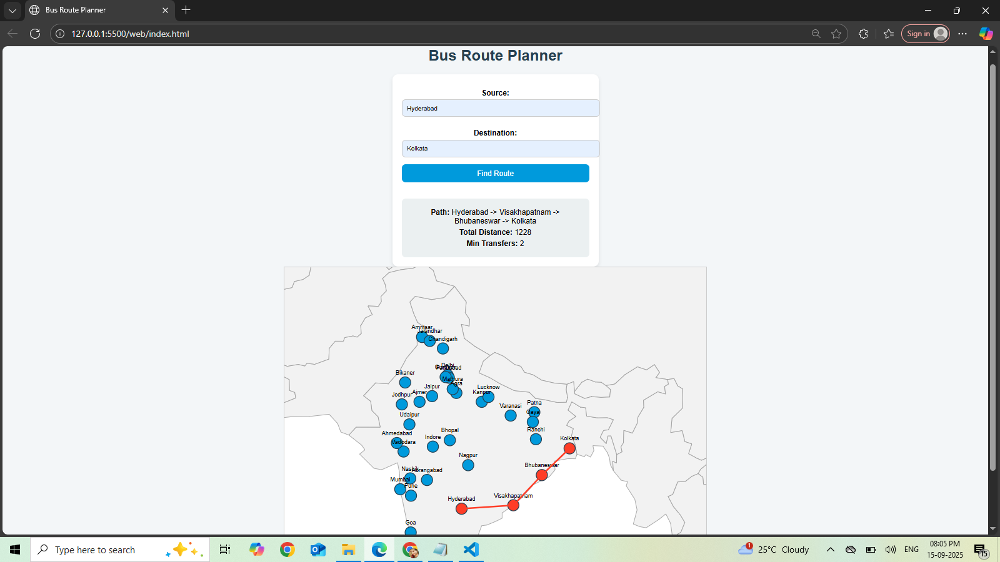

# 🚍 Optimal-Path-Finder-for-Public-Transport

An intelligent **Bus Route Optimization System** that computes the **shortest path** between cities using **graph algorithms** (Dijkstra + BFS).  
The system provides:  
- **Shortest path visualization on a map** 🗺️  
- **Minimum transfers calculation** 🔄  
- **Interactive web interface** 🌐  

---

## ✨ Features
- ✅ Load bus routes from a **CSV dataset**  
- ✅ Compute **shortest distance** between source & destination  
- ✅ Find **minimum number of transfers** required  
- ✅ Visualize the **optimized route on an interactive map** (D3.js + background world map)  
- ✅ Smooth zooming & panning support  

---

## 🏗️ Tech Stack
- **Backend:** C++ (Dijkstra + BFS) + Flask (Python API)  
- **Frontend:** HTML, CSS, JavaScript (D3.js for visualization)  
- **Dataset:** City-to-city bus routes with relative distances  

---

## 📂 Project Structure

```bash
BusRouteOptimization/
|-- Web--index.html
|-- app.py
├── BusRoutePlanner.cpp
├── BusRoutePlanner.h
├── main.cpp
├── app.py
├── index.html
├── BusRoutes.csv
├── output.png
└── README.md
```

---

## ⚙️ Setup Instructions

### 1. Clone Repository
```bash

git clone https://github.com/HymavathiBonamsetty/Optimal-Path-Finder-for-Public-Transport.git

cd Optimal-Path-Finder-for-Public-Transport

```

### 2. Build C++ Backend

```bash
g++ -std=c++17 BusRoutePlanner.cpp main.cpp -o bus_planner
```

### 3. Run Flask server

Make sure Python 3.x is installed along with Flask and Flask-CORS:
```bash
pip install flask flask-cors
python app.py
```
The web app will run at: http://127.0.0.1:5000

### 4. Open Frontend

- Open index.html for the route planner UI

---

## Dataset

The routes are stored in a CSV file `BusRoutes.csv` with the following format:
```bash
Source,Destination,Distance
Agra,Delhi,240
Delhi,Agra,240
Agra,Mathura,60
...
```
- Bi-directional routes are included.

- At least one path exists between any two cities.

---

## Algorithms Used

- Dijkstra’s Algorithm → To compute the shortest distance.

- BFS (Breadth-First Search) → To compute the minimum number of transfers.

---

## Example Output



Author

Hymavathi Bonamsetty
